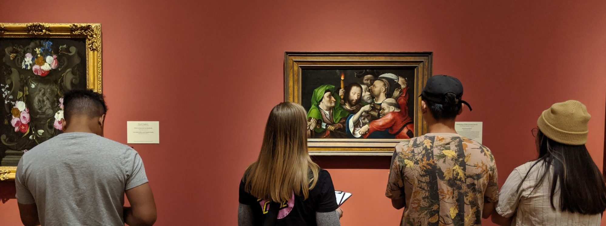

# Description

[TEXT HERE]

# Images

<!--

<iframe width="560" height="315" src="https://www.youtube.com/embed/oZYu1BHwKpI" title="YouTube video player" frameborder="0" allow="accelerometer; autoplay; clipboard-write; encrypted-media; gyroscope; picture-in-picture" allowfullscreen></iframe>

Demonstration from the [SD CSTA](https://csta.ucsd.edu/) Happy Hour, November 18, 2021, featuring Timothy Wood.

<iframe width="560" height="315" src="https://www.youtube.com/embed/-QucxZofqvs" title="YouTube video player" frameborder="0" allow="accelerometer; autoplay; clipboard-write; encrypted-media; gyroscope; picture-in-picture" allowfullscreen></iframe>

Demonstration of the Whiteboard and Gestural interface from the UCSD Design Innovation Building dedication November 18, 2021, featuring Tommy Sharkey.

  <iframe width="560" height="315" src="https://www.youtube.com/embed/2Dbk7BSQOII?t=2176" title="YouTube video player" frameborder="0" allow="accelerometer; autoplay; clipboard-write; encrypted-media; gyroscope; picture-in-picture" allowfullscreen></iframe>

 -->
 
# Studies

[Coming Soon]

# Generative Art+Empathy

[Coming Soon]

# Workshops, Presentations, Papers
- Abraham Schaecher ["Generative Art Based on the Input of Emotions"](https://drive.google.com/file/d/1iJKACKFgsaugdGessFOjrSw332WmAsPo/view?usp=sharing), UCARE 2021 presentation, Fall 2021
- ["Art + Empathy Lab" feature](https://drive.google.com/file/d/1ryMxhuMBpu7ZlP_TtnH7EVYjC7b3qCzC/view?usp=sharing), SDMA Members Magazine, San Diego Museum of Art, April-May 2020

# Team
- Ying Wu, PI [insight.ucsd.edu](https://insight.ucsd.edu)
- Robert Twomey, co-PI [roberttwomey.com](https://roberttwomey.com)
- Patrick Coleman, Investigator
- Sydney Kessler, Researcher
- Enrique, Researcher
- Abraham Schaecher, UCARE Undergraduate Researcher
- [TK Research Scientist from Germany]

# Contact
To learn more, contact PI Ying Wu at [ycwu@ucsd.edu](mailto:ycwu@ucsd.edu) or Robert Twomey at [rtwomey@unl.edu](mailto:rtwomey@unl.edu)

# Participating Labs

- [insight.ucsd.edu](https://insight.ucsd.edu)
- [cohab-lab.net](http://cohab-lab.net)
- [imagination.ucsd.edu](http://imagination.ucsd.edu)

# Support

This work is supported by a California Arts Council Research in the Arts Grant [LINK]
